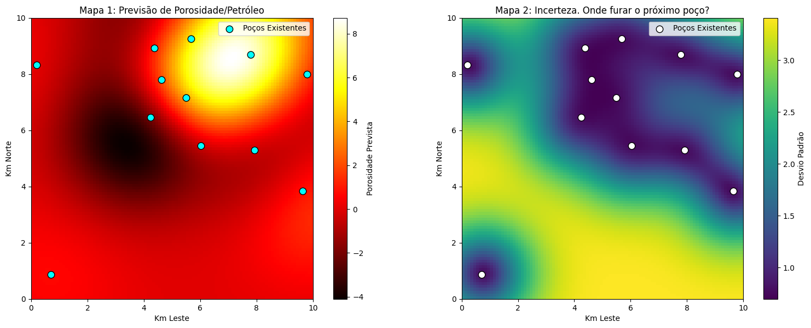
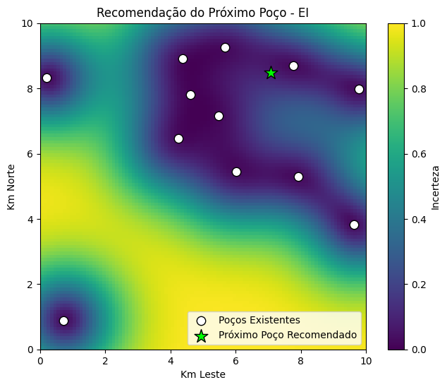

# Otimização da Localização de Poços de Petróleo com Processos Gaussianos

## 1. Objetivo

<p align="justify">
A perfuração de poços de petróleo possui um custo extremamente elevado. Em muitos cenários, cada novo poço pode representar centenas de milhares de reais em investimento. Dessa forma, surge uma pergunta fundamental: dado um pequeno conjunto de poços já perfurados, onde deve ser realizado o próximo poço para maximizar a probabilidade de encontrar petróleo?
</p>

<p align="justify">
Este projeto demonstra como Processos Gaussianos (Gaussian Processes - GP) podem ser utilizados para construir um mapa contínuo da região de interesse, estimando tanto a quantidade esperada de petróleo quanto a incerteza associada a cada localização. Dessa maneira, torna-se possível tomar decisões de perfuração baseadas em inferência estatística, reduzindo significativamente o risco operacional.
</p>

---

## 2. Problema

<p align="justify">
Suponha que apenas 12 poços tenham sido perfurados em um campo petrolífero. Cada poço fornece uma medição da porosidade da formação geológica, utilizada como indicador da presença de petróleo.
</p>

<p align="justify">
O desafio consiste em utilizar essas poucas amostras para estimar todo o campo geológico e identificar a melhor localização para o próximo poço.
</p>

<p align="justify">
Em vez de perfurar dezenas de novos poços para mapear toda a região, utiliza-se um Processo Gaussiano para interpolar os dados observados e fornecer estimativas para qualquer coordenada do campo.
</p>

---

## 3. Processo Gaussiano

<p align="justify">
Um Processo Gaussiano é um modelo probabilístico não paramétrico que assume que pontos próximos no espaço tendem a apresentar comportamentos semelhantes. Além da previsão da variável de interesse, o modelo fornece uma estimativa da incerteza associada a cada previsão.
</p>

<p align="justify">
Essa característica torna os Processos Gaussianos particularmente adequados para problemas em que as amostras são caras, como exploração mineral, geologia, engenharia, agricultura de precisão e otimização experimental.
</p>

---

## 4. Fluxo do Projeto

<p align="justify">
O projeto segue as seguintes etapas:
</p>

1. Simulação de um campo petrolífero.
2. Geração das amostras provenientes dos poços já perfurados.
3. Treinamento do Processo Gaussiano.
4. Predição em toda a região do campo.
5. Construção do mapa de previsão.
6. Construção do mapa de incerteza.
7. Escolha da localização ótima do próximo poço utilizando Bayesian Optimization.

---

## 5. Estrutura do Código

### Simulação do campo de petróleo

```python
def funcao_petroleo_real(x, y):
    return (
        10*np.exp(-((x-2)**2 + (y-3)**2)/4)
        + 15*np.exp(-((x-7)**2 + (y-8)**2)/2)
        + 8*np.exp(-((x-5)**2 + (y-2)**2)/3)
    )
```

### Geração dos poços existentes

```python
X_train = np.random.rand(12, 2) * 10

y_train = (
    funcao_petroleo_real(
        X_train[:,0],
        X_train[:,1]
    )
    + np.random.normal(0,1,12)
)
```

### Treinamento do Processo Gaussiano

```python
kernel = (
    C(10)
    * RBF(2)
    + WhiteKernel(1)
)

gp = GaussianProcessRegressor(
    kernel=kernel,
    n_restarts_optimizer=15
)

gp.fit(X_train, y_train)
```

### Predição do campo completo

```python
y_pred, sigma = gp.predict(
    X_pred,
    return_std=True
)
```

### Seleção do próximo poço (Expected Improvement)

```python
y_max = np.max(y_train)

ei = (
    (y_pred - y_max) * 0.5
    + sigma * 0.5
)

melhor_idx = np.argmax(ei)
```

---

## 6. Resultados

<p align="justify">
O Processo Gaussiano produz dois mapas fundamentais para a tomada de decisão.
</p>

### Mapa de previsão

<p align="justify">
O primeiro mapa representa a estimativa da porosidade em toda a região estudada. Áreas com valores elevados indicam maior probabilidade de existência de reservatórios de petróleo.
</p>

<p align="justify">
Os poços previamente perfurados são utilizados como pontos de referência para que o modelo estime valores nas regiões onde não existem medições.
</p>

<div align="center">

**Figura 1 — Mapa de previsão do campo petrolífero**



</div>

---

### Mapa de incerteza

<p align="justify">
O segundo mapa apresenta a incerteza das previsões realizadas pelo Processo Gaussiano. Regiões próximas aos poços conhecidos possuem baixa incerteza, enquanto áreas ainda não exploradas apresentam elevados valores de desvio padrão.
</p>

<p align="justify">
Esse mapa é extremamente importante, pois indica onde novas amostras podem fornecer maior ganho de informação para o modelo.
</p>

<div align="center">

**Figura 2 — Mapa de incerteza do Processo Gaussiano**



</div>

---

## 7. Estratégias para Escolha do Próximo Poço

<p align="justify">
Existem diferentes estratégias para selecionar a localização da próxima perfuração.
</p>

| Estratégia | Objetivo |
|------------|----------|
| **Exploit** | Escolher o ponto com maior previsão de petróleo. |
| **Explore** | Escolher o ponto de maior incerteza para aprender mais sobre o campo. |
| **Expected Improvement (EI)** | Equilibrar exploração e aproveitamento simultaneamente. |

<p align="justify">
Neste projeto foi utilizada uma versão simplificada do Expected Improvement, que combina a previsão do modelo com sua incerteza. Essa abordagem constitui a base da Otimização Bayesiana (Bayesian Optimization), amplamente empregada na indústria de petróleo e gás.
</p>

---

## 8. Aplicações

<p align="justify">
Embora o exemplo seja baseado na exploração de petróleo, a mesma metodologia pode ser aplicada em diversos problemas reais nos quais a obtenção de novas amostras possui elevado custo financeiro ou operacional.
</p>

- Exploração mineral.
- Agricultura de precisão.
- Geologia.
- Engenharia de reservatórios.
- Descoberta de novos materiais.
- Otimização de experimentos laboratoriais.
- Ajuste automático de hiperparâmetros em Machine Learning.

---

## 9. Tecnologias Utilizadas

- Python
- NumPy
- Matplotlib
- Scikit-Learn
- Gaussian Process Regression
- Bayesian Optimization

---

## 10. Conclusão

<p align="justify">
Os Processos Gaussianos permitem transformar um pequeno conjunto de medições em um mapa probabilístico completo da região de interesse. Além de estimar onde existe maior probabilidade de encontrar petróleo, o modelo informa o grau de confiança de cada previsão, permitindo decisões muito mais fundamentadas do que estratégias baseadas apenas em amostragem uniforme ou experiência humana.
</p>

<p align="justify">
Ao combinar previsão e incerteza por meio da Otimização Bayesiana, torna-se possível reduzir significativamente o número de perfurações necessárias para caracterizar um campo petrolífero, diminuindo custos e aumentando a eficiência das operações exploratórias.
</p>

